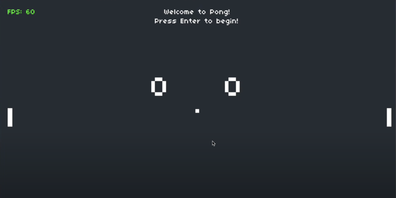

# Pong

A LÖVE2D recreation of the classic Pong game, made as the first project in CS50's Game Development course.



## Description

This project is a simple two-player Pong clone that introduces basic game development concepts using Lua and the LÖVE2D framework. It was created as part of CS50's Game Development course and focuses on:

- Paddle and ball collision detection
- Simple physics and reflection angles
- Game state management (start, play, score, win)
- Keyboard input handling and score tracking

## How to Play

### Controls

**Player 1 (Left)**  
- `W`: Move paddle up  
- `S`: Move paddle down  

**Player 2 (Right)**  
- `Up Arrow`: Move paddle up  
- `Down Arrow`: Move paddle down  

### Objective

Score 10 points before your opponent by hitting the ball past their paddle.

## Development

### Built With

- [LÖVE2D](https://love2d.org/) — Framework for 2D game development  
- Lua — Programming language used in the course

### Project Structure

- `main.lua` — Game loop and main logic  
- `Paddle.lua` — Paddle class  
- `Ball.lua` — Ball class  
- `class.lua` — Class library used for OOP  
- `push.lua` — Resolution-handling library  
- `font.ttf` — Pixel-style font  
- `sounds/` — Game sound effects

## Installation and Running

1. [Download and install LÖVE2D](https://love2d.org/)
2. Clone the repo:
   ```bash
   git clone https://github.com/ethanperello/pong.git
   ```
3. Run the game:
   ```bash
   love pong
   ```

## Demo

[Watch the gameplay demo](https://www.youtube.com/watch?v=r5pTh3Sn_Pk)

## Credits

- Developed by Ethan Perello  
- Created as part of CS50's Game Development course  
- Sound effects from [freesound.org](https://freesound.org/)

